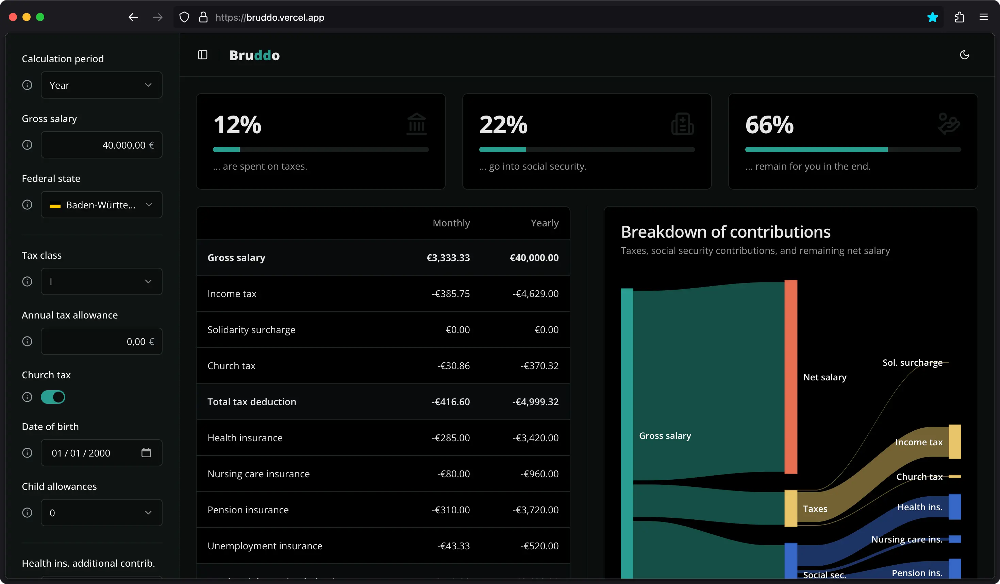

# Bruddo

A modern and minimalistic gross-net salary calculator for Germany, built with Next.js and Shadcn UI.



Check out the live version at [bruddo.vercel.app](https://bruddo.vercel.app).

## Features

- Interactive salary calculation form
- Detailed breakdown of gross and net income
- Interactive charts
- Responsive design
- Dark/light theme support
- Internationalization support

## Getting Started

### Prerequisites

- Node.js >= 22
- pnpm >= 9

### Installation

1. Clone the repository
2. Install dependencies:
   ```bash
   pnpm install
   ```
3. Start the development server:
   ```bash
   pnpm dev
   ```

The application will be available at [http://localhost:3000](http://localhost:3000).

## Contribute

Feel free to open an issue to report bugs, suggest features, or submit pull requests. I welcome all
contributions that help make Bruddo better! 🚀
